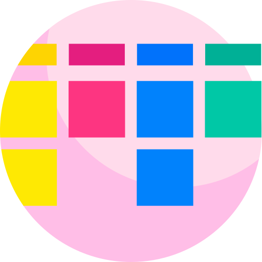

<div align="center" ></div>

# Kanban Board
#### Projeto que é um gerenciador de tarefas. Funciona através da gestão visual, ou seja, é fácil olhar para o quadro e entender o status das entregas e também o que precisa ser feito, isso estimula a autonomia da equipe de trabalho já que eles podem verificar sozinhos o andamento das entregas. 🚀


### 🧪 Tecnologias Utilizadas
- ReactJS
- NextJS
- Typescript
- Styled-component
 
## 🚀 Como usar

#### clonar o repositório
```bash
git clone https://github.com/Gabriela-Leite/Kanban.git
```

#### instalar as dependências
```bash
yarn install ou npm install
```

#### rodando o projeto
```bash
yarn dev ou npm run dev
```
#### melhorias a serem feitas
- Shimmer
- drag and' drop


##### Opa, bom dia ☀️ por Gabriela Miranda
